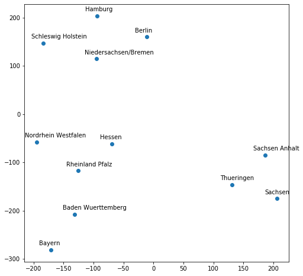
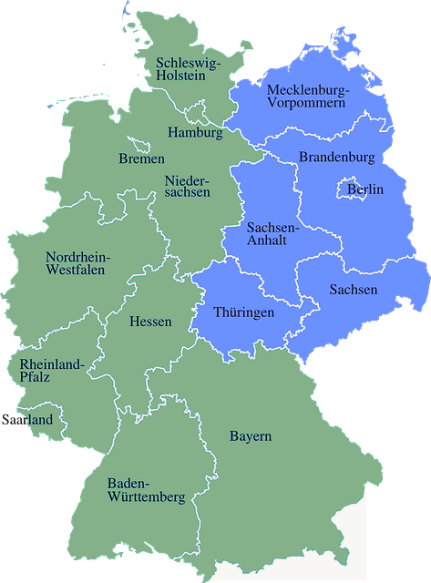

This is the code used in the paper **"[Entity Embeddings of Categorical Variables](http://arxiv.org/abs/1604.06737)"**. If you want to get the original version of the code used for the Kaggle competition, please use [**the Kaggle branch**](https://github.com/entron/entity-embedding-rossmann/tree/kaggle).

To run the code one needs first download and unzip the `train.csv` and `store.csv` files on [Kaggle](https://www.kaggle.com/c/rossmann-store-sales/data) and put them in this folder.

If you use [Anaconda](https://docs.conda.io/en/latest/miniconda.html) you can install the dependecies like the following example:

```
conda create --name ee python=3.7 pip
conda activate ee
pip install scikit-learn xgboost tensorflow keras jupyter matplotlib
```
Please refer to [Keras](https://github.com/fchollet/keras) for more details regarding how to install keras. 

Next, run the following scripts to extract the csv files and prepare the features:

```
python3 extract_csv_files.py
python3 prepare_features.py
```

To run the models:

```
python3 train_test_model.py
```

You can anaylize the embeddings with [plot_embeddings.ipynb](https://github.com/entron/entity-embedding-rossmann/blob/master/plot_embeddings.ipynb). For example, the following are the learned embeeding of German States printed in 2D and the map of Germany side by side.   Considering the algorithm knows nothing about German geography the remarkable resemblance between the two demonstrates the power of the algorithm for abductive reasoning. I expect entity embedding will be a very useful tool to study the relationship of genome, proteins, drugs, diseases and I would love to see its applications in biology and medicine one day.

Visualizaiton of Entity Embedding of German States in 2D             | Map of Germany 
:-------------------------:|:-------------------------:
  |  

